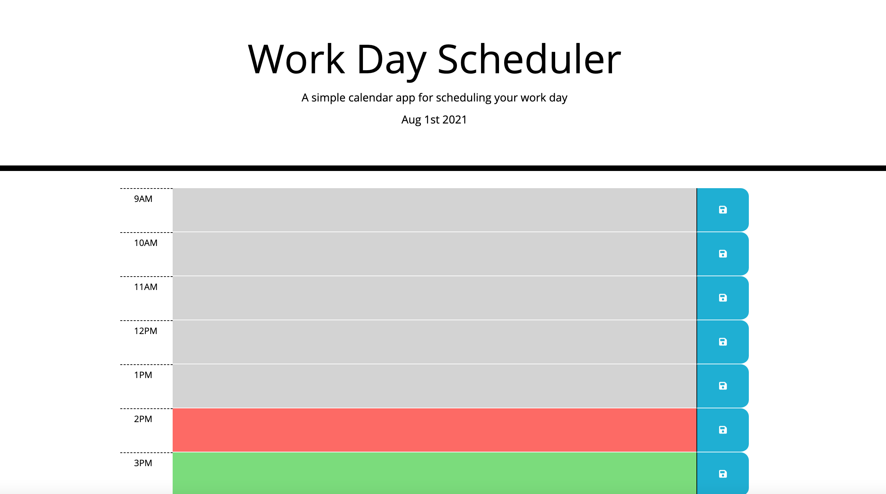

# Work Day Scheduler

## Description

This is a work day scheduler that color-codes time blocks based on whether the time is in the past, present, or future. Clicking on a timeblock lets you enter in a text description. Clicking on the save button saves the description into local storage.

[https://kimcc.github.io/work-day-scheduler](https://kimcc.github.io/work-day-scheduler)

## Libraries
- jQuery
- Moment.js
- Bootstrap